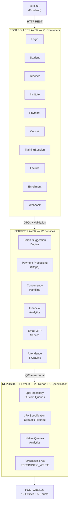
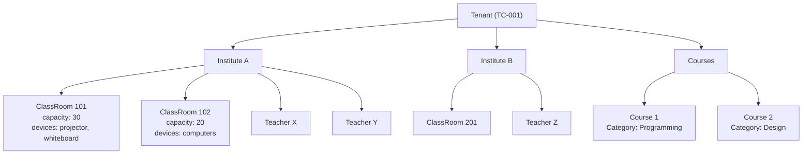
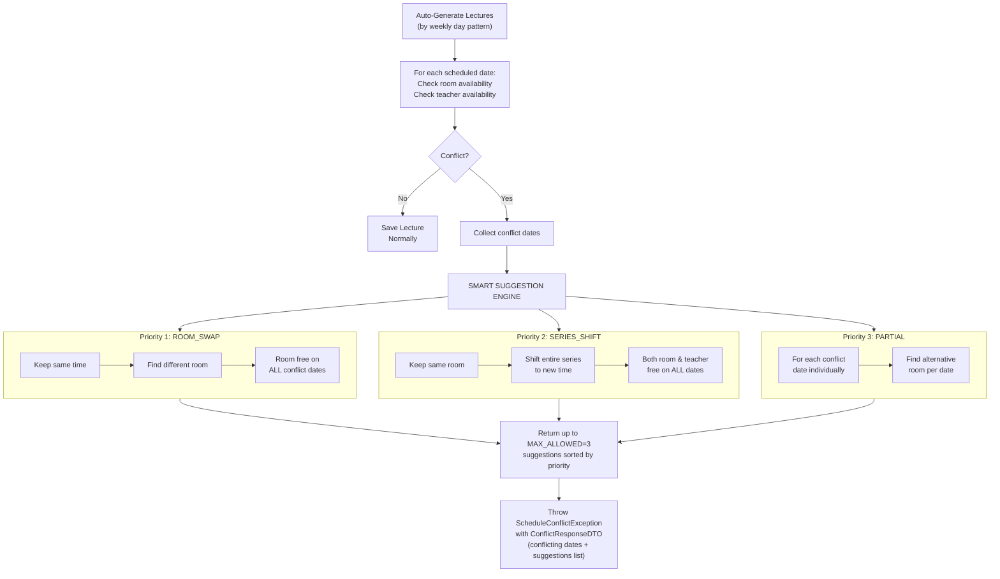
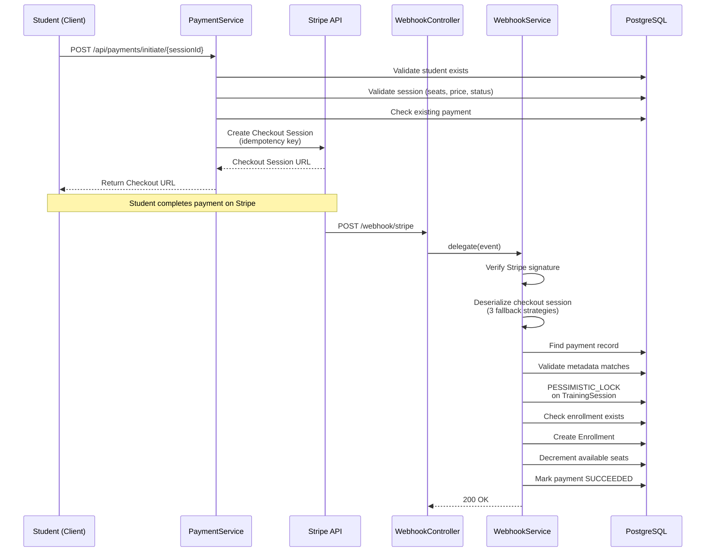
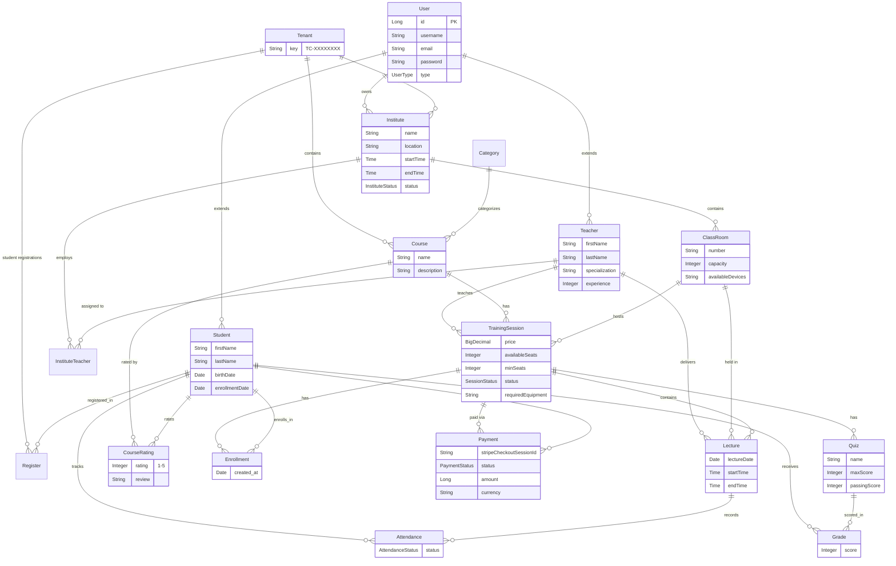

<p align="center">
  <h1 align="center">Training Center Management System</h1>
  <p align="center">A comprehensive RESTful API for managing training centers, courses, enrollments, payments, and scheduling — built as a 4th-year university capstone project.</p>
</p>

<p align="center">
  
  
  
  
  
  
  
  
</p>

---

## Table of Contents

- [Overview & Features](#overview--features)
- [Tech Stack](#tech-stack)
- [Architecture](#architecture)
- [Project Structure](#project-structure)
- [Smart Suggestion Algorithm](#smart-suggestion-algorithm)
- [Payment & Concurrency Handling](#payment--concurrency-handling)
- [Database Schema](#database-schema)
- [Professional Queries](#professional-queries)
- [API Documentation](#api-documentation)
- [Installation & Setup](#installation--setup)
- [Future Improvements](#future-improvements)

---

## Overview & Features

The **Training Center Management System** is a full-featured backend API designed to streamline the operations of training centers and educational institutes. It supports multi-tenancy, role-based access, automated scheduling with intelligent conflict resolution, secure payment processing, and real-time analytics.

### Key Features

| Feature | Description |
|---|---|
| **Multi-Tenant Architecture** | Each training center operates as an isolated tenant with its own institutes, courses, teachers, and students |
| **Role-Based System** | Three distinct roles — Admin, Student, Teacher — each with tailored endpoints and data access |
| **Smart Classroom Suggestion** | AI-inspired 3-priority algorithm that automatically resolves scheduling conflicts by suggesting alternative rooms or time slots |
| **Stripe Payment Integration** | Full payment lifecycle — checkout session creation, webhook processing, idempotent enrollment, and financial reporting |
| **Concurrency Control** | Pessimistic locking and race condition handling across payment and enrollment operations |
| **Dynamic Filtering** | JPA Specification-based dynamic query builder for advanced course/session search with multiple optional filters |
| **Attendance & Grading** | Lecture-level attendance tracking with session statistics and quiz-based grading |
| **Course Ratings** | Students can rate and review courses with average rating calculations |
| **Image Upload** | Cloudinary-powered image storage for profile pictures and session images |
| **Email OTP Verification** | Email-based one-time password system for password reset flows |
| **Auto Lecture Generation** | Automatic lecture creation based on weekly day patterns with inline conflict detection |
| **Financial Analytics** | Monthly revenue reports, registration trends, and dashboard metrics per institute |
| **Swagger Documentation** | Interactive API documentation via SpringDoc OpenAPI |
| **CI/CD Pipeline** | Automated build and deployment to Azure via GitHub Actions |
| **Docker Support** | Multi-stage Docker build for consistent deployment across environments |

---

## Tech Stack

| Layer | Technology | Version |
|---|---|---|
| **Language** | Java | 17 |
| **Framework** | Spring Boot | 3.5.11 |
| **ORM** | Spring Data JPA / Hibernate | — |
| **Database** | PostgreSQL | 16 |
| **Security** | Spring Security (BCrypt) | — |
| **Payment** | Stripe Java SDK | 24.9.0 |
| **Image Upload** | Cloudinary SDK | 1.39.0 |
| **API Docs** | SpringDoc OpenAPI | 2.8.5 |
| **Email** | Spring Boot Mail (Gmail SMTP) | — |
| **Validation** | Jakarta Bean Validation | — |
| **Monitoring** | Spring Boot Actuator | — |
| **Build** | Maven | 3.9.9 |
| **Code Gen** | Lombok | — |
| **Container** | Docker (multi-stage) | — |
| **CI/CD** | GitHub Actions | — |
| **Deployment** | Azure Web Apps | — |

---

## Architecture

The project follows a **layered 3-tier monolithic architecture** with a multi-tenant isolation model:



### Multi-Tenant Model



---

## Project Structure

```
src/main/java/com/trainingcenter/management/
├── TrainingCenterManagementApplication.java    # Entry point (@EnableScheduling)
├── config/
│   ├── CloudinaryConfig.java                   # Cloudinary bean setup
│   ├── OpenApiConfig.java                      # Swagger UI configuration
│   └── UserDataSeeder.java                     # Default data seeder
├── controller/                                 # 21 REST Controllers
│   ├── LoginController.java                    # Authentication
│   ├── UserController.java                     # User CRUD + password reset
│   ├── StudentController.java                  # Student profiles + stats
│   ├── TeacherController.java                  # Teacher profiles + schedules
│   ├── InstituteController.java                # Institutes + analytics
│   ├── ClassRoomController.java                # Classroom management
│   ├── CourseController.java                   # Course catalog
│   ├── CategoryController.java                 # Categories
│   ├── TenantController.java                   # Multi-tenant management
│   ├── TrainingSessionController.java          # Sessions + dynamic filtering
│   ├── LectureController.java                  # Lecture CRUD
│   ├── EnrollmentController.java               # Enrollment management
│   ├── AttendanceController.java               # Attendance tracking
│   ├── PaymentController.java                  # Stripe payment initiation
│   ├── WebhookController.java                  # Stripe webhook receiver
│   ├── QuizController.java                     # Quiz management
│   ├── GradeController.java                    # Student grading
│   ├── CourseRatingController.java             # Course reviews
│   ├── InstituteTeacherController.java         # Teacher-Institute assignment
│   ├── RegisterController.java                 # Student-Tenant registration
│   └── OtpController.java                      # OTP verification
├── dto/                                        # 55 Data Transfer Objects
│   ├── *RequestDTO.java                        # Inbound request payloads
│   ├── *ResponseDTO.java                       # Outbound response payloads
│   ├── AvailableOptionDTO.java                 # Smart suggestion response
│   ├── ConflictResponseDTO.java                # Conflict resolution response
│   └── ...
├── entity/                                     # 19 Entities + 5 Enums
│   ├── User.java                               # Base user (ADMIN/STUDENT/TEACHER)
│   ├── Student.java                            # Student profile
│   ├── Teacher.java                            # Teacher profile
│   ├── Institute.java                          # Training center
│   ├── Tenant.java                             # Tenant isolation key
│   ├── ClassRoom.java                          # Physical classroom
│   ├── Course.java                             # Course catalog
│   ├── TrainingSession.java                    # Scheduled session
│   ├── Lecture.java                            # Individual lecture
│   ├── Enrollment.java                         # Student-Session link
│   ├── Payment.java                            # Stripe payment record
│   ├── Attendance.java                         # Lecture attendance
│   ├── Quiz.java / Grade.java                  # Assessment
│   ├── CourseRating.java                       # Reviews
│   ├── Register.java                           # Student-Tenant registration
│   └── enums/ (SessionStatus, PaymentStatus, AttendanceStatus, ...)
├── exception/                                  # 5 Custom Exceptions
│   ├── ResourceNotFoundException.java
│   ├── DuplicateResourceException.java
│   ├── BadRequestException.java
│   ├── ScheduleConflictException.java          # Carries ConflictResponseDTO
│   └── GlobalExceptionHandler.java
├── repository/                                 # 20 Repositories + 1 Specification
│   ├── *Repository.java                        # Spring Data JPA interfaces
│   └── TrainingSessionSpecification.java       # Dynamic Criteria API filtering
├── security/
│   ├── SecurityConfig.java                     # Spring Security configuration
│   └── CustomUserDetailsService.java           # UserDetailsService impl
└── service/                                    # 22 Business Services
    ├── LectureService.java                     # Smart Suggestion Engine
    ├── PaymentService.java                     # Stripe integration
    ├── WebhookService.java                     # Webhook + concurrency handling
    ├── TrainingSessionService.java             # Session CRUD + filtering
    ├── EnrollmentService.java                  # Enrollment + race condition handling
    ├── AttendanceService.java                  # Attendance tracking
    └── ...
```

---

## Smart Suggestion Algorithm

One of the core innovations of this system is the **Smart Suggestion Engine** (`LectureService.java:174-299`), which automatically resolves scheduling conflicts when auto-generating lectures. When a room or teacher conflict is detected, the engine runs a **3-priority cascading algorithm** to find viable alternatives.

### How It Works



### Priority 1: ROOM_SWAP

**Goal:** Keep the original time slot, move all lectures to a different room.

```
Original:  Monday 09:00-11:00 in Room 101  ← CONFLICT
Suggestion: Monday 09:00-11:00 in Room 103  ✓ FREE on all conflict dates
```

**Algorithm:**
1. Fetch all classrooms in the same institute
2. For each room (excluding the conflicting one):
   - Check `capacity >= minSeats` for the training session
   - Check equipment compatibility (e.g., room must have "computers" if session requires it)
   - Verify the room is free on **ALL** conflicting dates simultaneously using `existsConflict()` query
3. Add valid rooms to suggestions (up to MAX_ALLOWED = 3)

**Key Query:**
```sql
SELECT COUNT(l) > 0 FROM Lecture l
WHERE l.classRoom.id = :roomId
  AND l.lectureDate = :date
  AND (:start < l.endTime AND :end > l.startTime)
```

### Priority 2: SERIES_SHIFT

**Goal:** Keep the same room, shift the entire lecture series to a new time slot.

```
Original:  Room 101, Monday 09:00-11:00  ← CONFLICT
Suggestion: Room 101, Monday 11:00-13:00  ✓ Both room & teacher free
```

**Algorithm:**
1. Get institute working hours (e.g., 08:00 - 20:00)
2. Scan time slots in **30-minute increments** from opening to (closing - lecture duration)
3. For each candidate slot:
   - Check the room is free on ALL conflict dates
   - Check the teacher is free on ALL conflict dates
4. If both conditions pass, add as a SERIES_SHIFT suggestion

### Priority 3: PARTIAL

**Goal:** For each individual conflict date, find a room that works just for that day.

```
Date 1 (Mon): Room 103  ✓
Date 2 (Wed): Room 102  ✓  (different rooms for different dates)
```

**Algorithm:**
1. For each conflicting date, use `findAvailableRoomsWithFeatures()` to find rooms that are:
   - In the same institute
   - Have sufficient capacity
   - Have required equipment
   - Are free on that specific date
2. If ALL conflict dates can be resolved, add partial suggestions
3. Partial suggestions are added up to the remaining MAX_ALLOWED slots

**Key Query (findAvailableRoomsWithFeatures):**
```sql
SELECT r FROM ClassRoom r
WHERE r.institute.id = :instituteId
  AND r.capacity >= :minSeats
  AND (:requiredDevice IS NULL OR :requiredDevice = ''
       OR LOWER(r.availableDevices) LIKE LOWER(CONCAT('%', :requiredDevice, '%')))
  AND NOT EXISTS (
      SELECT l FROM Lecture l
      WHERE l.classRoom.id = r.id
        AND l.lectureDate = :date
        AND (:start < l.endTime AND :end > l.startTime)
  )
```

### Conflict Response Structure

```json
{
  "message": "Conflict detected on 3 dates.",
  "conflictingDates": ["2025-03-10", "2025-03-12", "2025-03-14"],
  "suggestions": [
    {
      "suggestionType": "ROOM_SWAP",
      "roomId": 5,
      "roomNumber": "103",
      "date": "2025-03-10",
      "startTime": "09:00:00",
      "endTime": "11:00:00",
      "note": "Move all sessions to Room 103"
    },
    {
      "suggestionType": "SERIES_SHIFT",
      "roomId": 1,
      "roomNumber": "101",
      "date": "2025-03-10",
      "startTime": "11:00:00",
      "endTime": "13:00:00",
      "note": "Shift the entire series to: 11:00"
    }
  ]
}
```

---

## Payment & Concurrency Handling

### Payment Flow

The system integrates with **Stripe Checkout Sessions** for secure payment processing with full idempotency and webhook-based confirmation.



### Concurrency Challenges & Solutions

#### Challenge 1: Race Condition on Seat Decrement

**Problem:** When two webhook events arrive simultaneously for the same training session, both could read `availableSeats = 5`, decrement to 4, and save — resulting in an over-booking (one seat sold twice).

**Solution: Pessimistic Locking**

```java
// TrainingSessionRepository.java
@Lock(LockModeType.PESSIMISTIC_WRITE)
@Query("SELECT ts FROM TrainingSession ts WHERE ts.id = :id")
Optional<TrainingSession> findByIdForUpdate(@Param("id") Long id);
```

```java
// WebhookService.java — called within @Transactional
TrainingSession trainingSession = trainingSessionRepository
    .findByIdForUpdate(payment.getTrainingSession().getId())
    .orElseThrow(...);

// Now the row is locked — other transactions wait until this one commits/rolls back
trainingSession.setAvailableSeats(trainingSession.getAvailableSeats() - 1);
```

**How it works:**
1. Transaction A acquires `PESSIMISTIC_WRITE` lock on the TrainingSession row
2. Transaction B attempts the same lock → **blocks** until A commits
3. When B acquires the lock, it reads the **updated** seat count (already decremented by A)
4. B decrements again → correct count maintained

#### Challenge 2: Duplicate Enrollment from Concurrent Webhooks

**Problem:** Stripe may send the same webhook event multiple times. Two concurrent webhook calls could both try to create the same enrollment, violating the unique constraint `(student_id, training_session_id)`.

**Solution: Catch & Verify Pattern**

```java
// WebhookService.java
try {
    Enrollment enrollment = new Enrollment();
    enrollment.setStudent(student);
    enrollment.setTrainingSession(trainingSession);
    trainingSession.setAvailableSeats(trainingSession.getAvailableSeats() - 1);
    enrollmentRepository.save(enrollment);
    trainingSessionRepository.save(trainingSession);
    markPaymentSucceeded(payment);
} catch (DataIntegrityViolationException ex) {
    // Another transaction already created the enrollment
    if (enrollmentRepository.existsByStudentAndTrainingSession(student, trainingSession)) {
        markPaymentSucceeded(payment); // Just mark payment as done
        return;
    }
    throw ex; // Real error — re-throw
}
```

#### Challenge 3: Duplicate Payment Record Creation

**Problem:** Two simultaneous `initiatePayment` calls could both create new Payment records, violating the unique constraint `(student_id, training_session_id)`.

**Solution: Idempotency Keys + Collision Recovery**

```java
// PaymentService.java — Stripe API call with idempotency key
Session checkoutSession = Session.create(
    buildCheckoutSessionParams(student, trainingSession, amountInCents),
    RequestOptions.builder()
        .setIdempotencyKey("checkout-" + studentId + "-" + trainingSessionId)
        .build()
);

// Database save with collision handling
try {
    paymentRepository.save(payment);
} catch (DataIntegrityViolationException ex) {
    // Re-read the existing record and reuse it
    Payment current = paymentRepository
        .findByStudentAndTrainingSession(student, trainingSession)
        .orElseThrow(...);
    // Handle based on current status (PENDING → reuse, SUCCEEDED → reject)
}
```

#### Challenge 4: Stripe Webhook Deserialization Failures

**Problem:** Stripe's SDK sometimes fails to deserialize webhook payloads cleanly.

**Solution: 3-Layer Fallback Deserialization**

```java
// WebhookService.java — resolveCheckoutSession()
// Attempt 1: Direct SDK deserialization
if (deserializer.getObject().isPresent()) { ... }

// Attempt 2: Unsafe deserialization (handles edge cases)
try { deserializer.deserializeUnsafe(); ... }

// Attempt 3: Raw JSON parsing with Jackson
JsonNode root = objectMapper.readTree(rawJson);
// Extract sessionId and metadata manually
```

### Financial Reporting Queries

**Monthly Revenue by Institute:**
```sql
SELECT
    EXTRACT(MONTH FROM p.createdAt) AS month,
    SUM(p.amount) AS totalRevenue,
    COUNT(*) AS totalPayments
FROM Payment p
JOIN p.trainingSession ts
JOIN ts.classRoom cr
WHERE cr.institute.id = :instituteId
  AND p.status = 'SUCCEEDED'
  AND EXTRACT(YEAR FROM p.createdAt) = :year
GROUP BY EXTRACT(MONTH FROM p.createdAt)
ORDER BY EXTRACT(MONTH FROM p.createdAt)
```

**Monthly Registrations by Institute:**
```sql
SELECT
    EXTRACT(MONTH FROM e.created_at) AS month,
    COUNT(*) AS registrations
FROM enrollments e
JOIN training_sessions ts ON e.training_session_id = ts.id
JOIN classrooms cr ON ts.classroom_id = cr.id
WHERE cr.institute_id = :instituteId
  AND EXTRACT(YEAR FROM e.created_at) = :year
GROUP BY EXTRACT(MONTH FROM e.created_at)
ORDER BY EXTRACT(MONTH FROM e.created_at)
```

---

## Database Schema

### Entity Relationship Diagram



### Key Entities & Unique Constraints

| Entity | Unique Constraints | Purpose |
|---|---|---|
| `Payment` | `(student_id, training_session_id)` | One payment per student per session |
| `Enrollment` | `(student_id, training_session_id)` | One enrollment per student per session |
| `Attendance` | `(student_id, lecture_id)` | One attendance record per lecture |
| `Register` | `(student_id, tenant_id)` | One registration per student per tenant |
| `Grade` | `(student_id, quiz_id)` | One grade per quiz per student |
| `Quiz` | `(name, training_session_id)` | Unique quiz names within a session |
| `CourseRating` | `(course_id, student_id)` | One review per student per course |
| `InstituteTeacher` | `(institute_id, teacher_id)` | One assignment per teacher per institute |

---

## Professional Queries

The repository layer contains **40+ custom queries** ranging from simple lookups to complex analytics:

### JPQL Queries (Type-Safe)

**Dynamic Multi-Filter Search (JPA Specification):**
```java
// TrainingSessionSpecification.java — builds dynamic predicates
public static Specification<TrainingSession> withFilters(
        Long categoryId, String categoryName, String courseName,
        String instituteName, String location,
        BigDecimal minPrice, BigDecimal maxPrice,
        Boolean availableForRegistration) {

    return (root, query, criteriaBuilder) -> {
        List<Predicate> predicates = new ArrayList<>();

        if (categoryId != null)
            predicates.add(criteriaBuilder.equal(
                root.join("course").join("category").get("id"), categoryId));

        if (courseName != null && !courseName.trim().isEmpty())
            predicates.add(criteriaBuilder.like(
                criteriaBuilder.lower(root.join("course").get("name")),
                "%" + courseName.toLowerCase() + "%"));

        if (minPrice != null)
            predicates.add(criteriaBuilder.greaterThanOrEqualTo(
                root.get("price"), minPrice));

        // ... more filters dynamically added

        return criteriaBuilder.and(predicates.toArray(new Predicate[0]));
    };
}
```

**Fetch Join for N+1 Prevention:**
```java
// LectureRepository.java — student weekly schedule (avoids N+1)
@Query("SELECT l FROM Lecture l "
     + "JOIN FETCH l.trainingSession ts "
     + "JOIN FETCH ts.course c "
     + "JOIN FETCH l.classRoom cr "
     + "JOIN FETCH l.teacher t "
     + "WHERE l.trainingSession.id IN ("
     + "  SELECT e.trainingSession.id FROM Enrollment e "
     + "  WHERE e.student.id = :studentId"
     + ") AND l.lectureDate BETWEEN :startDate AND :endDate "
     + "ORDER BY l.lectureDate, l.startTime")
List<Lecture> findStudentWeeklySchedule(...);
```

**Pessimistic Locking:**
```java
@Lock(LockModeType.PESSIMISTIC_WRITE)
@Query("SELECT ts FROM TrainingSession ts WHERE ts.id = :id")
Optional<TrainingSession> findByIdForUpdate(@Param("id") Long id);
```

**Batch Aggregation:**
```java
@Query("SELECT e.trainingSession.course.id, COUNT(DISTINCT e.student.id) "
     + "FROM Enrollment e "
     + "WHERE e.trainingSession.teacher.id = :teacherId "
     + "GROUP BY e.trainingSession.course.id")
List<Object[]> countStudentsByTeacherPerCourse(@Param("teacherId") Long teacherId);
```

### Native Queries (PostgreSQL-Specific)

**Monthly Financial Performance:**
```sql
SELECT EXTRACT(MONTH FROM p.createdAt) AS month,
       SUM(p.amount) AS totalRevenue,
       COUNT(*) AS totalPayments
FROM Payment p
JOIN p.trainingSession ts
JOIN ts.classRoom cr
WHERE cr.institute.id = :instituteId
  AND p.status = 'SUCCEEDED'
  AND EXTRACT(YEAR FROM p.createdAt) = :year
GROUP BY EXTRACT(MONTH FROM p.createdAt)
ORDER BY EXTRACT(MONTH FROM p.createdAt)
```

**Monthly Registration Trends:**
```sql
SELECT EXTRACT(MONTH FROM e.created_at) AS month,
       COUNT(*) AS registrations
FROM enrollments e
JOIN training_sessions ts ON e.training_session_id = ts.id
JOIN classrooms cr ON ts.classroom_id = cr.id
WHERE cr.institute_id = :instituteId
  AND EXTRACT(YEAR FROM e.created_at) = :year
GROUP BY EXTRACT(MONTH FROM e.created_at)
ORDER BY EXTRACT(MONTH FROM e.created_at)
```

### Query Categories Summary

| Category | Count | Examples |
|---|---|---|
| **Conflict Detection** | 3 | `existsConflict`, `isTeacherBusy`, `findAvailableRoomsWithFeatures` |
| **Aggregation** | 5 | `findTopEnrolledTrainingSessions`, `countStudentsByTeacherPerCourse`, `getStudentSessionAttendanceStats` |
| **Date Range** | 3 | `findStudentWeeklySchedule`, `findTeacherWeeklySchedule`, monthly analytics |
| **Dynamic Filtering** | 1 | `TrainingSessionSpecification` (7 optional filters) |
| **Pessimistic Locking** | 1 | `findByIdForUpdate` with `PESSIMISTIC_WRITE` |
| **Native Analytics** | 2 | Monthly financial performance, monthly registration trends |
| **Fetch Joins** | 4 | Student schedule, teacher schedule, attendance details, active students |
| **Existence Checks** | 2 | `existsByStudentAndTrainingSession`, `existsByStudentIdAndTrainingSession_CourseId` |

---

## API Documentation

The API is fully documented via **Swagger UI** available at runtime:

- **Swagger UI:** `http://localhost:8080/swagger-ui/index.html`
- **OpenAPI Spec:** `http://localhost:8080/v3/api-docs`

### Endpoint Overview (21 Controllers)

| Controller | Base Path | Key Endpoints |
|---|---|---|
| **LoginController** | `/api/auth` | `POST /login` |
| **UserController** | `/api/users` | CRUD, `POST /reset-password` |
| **StudentController** | `/api/students` | CRUD, profile image, stats, schedule |
| **TeacherController** | `/api/teachers` | CRUD, profile image, weekly schedule |
| **InstituteController** | `/api/institutes` | CRUD, student counts, financial stats, monthly registrations |
| **ClassRoomController** | `/api/classrooms` | CRUD, search by device |
| **CourseController** | `/api/courses` | CRUD, search, active courses |
| **CategoryController** | `/api/categories` | CRUD |
| **TenantController** | `/api/tenants` | CRUD |
| **TrainingSessionController** | `/api/training-sessions` | CRUD, filtered search (7 params), image upload, top enrolled |
| **LectureController** | `/api/lectures` | CRUD, by session |
| **EnrollmentController** | `/api/enrollments` | Create, delete, by session, active courses |
| **AttendanceController** | `/api/attendance` | Bulk mark, by lecture, by student |
| **PaymentController** | `/api/payments` | `POST /initiate/{sessionId}` |
| **WebhookController** | `/webhook/stripe` | Stripe webhook receiver |
| **QuizController** | `/api/quizzes` | CRUD |
| **GradeController** | `/api/grades` | CRUD |
| **CourseRatingController** | `/api/course-ratings` | CRUD, average rating, top reviews |
| **InstituteTeacherController** | `/api/institute-teachers` | Assign/remove/update teacher-institute |
| **RegisterController** | `/api/registers` | Student-tenant registration |
| **OtpController** | `/api/otp` | Generate, verify, reset password |

---

## Installation & Setup

### Prerequisites

- **Java 17** or higher
- **Maven 3.9+** (or use the included Maven Wrapper `./mvnw`)
- **PostgreSQL 14+**
- **Stripe Account** (for payment features)
- **Cloudinary Account** (for image uploads)

### 1. Clone the Repository

```bash
git clone https://github.com/your-org/training-center-management.git
cd training-center-management
```

### 2. Set Up the Database

```sql
CREATE DATABASE training_center;
```

### 3. Configure Environment Variables

Create `application-local.properties` or set environment variables:

```properties
# Database
SPRING_DATASOURCE_URL=jdbc:postgresql://localhost:5432/training_center
SPRING_DATASOURCE_USERNAME=your_username
SPRING_DATASOURCE_PASSWORD=your_password

# Stripe
STRIPE_SECRET_KEY=sk_test_...
STRIPE_WEBHOOK_SECRET=whsec_...
STRIPE_CHECKOUT_SUCCESS_URL=http://localhost:8080/payment/success
STRIPE_CHECKOUT_CANCEL_URL=http://localhost:8080/payment/cancel

# Cloudinary
CLOUDINARY_CLOUD_NAME=your_cloud_name
CLOUDINARY_API_KEY=your_api_key
CLOUDINARY_API_SECRET=your_api_secret

# Email (Gmail SMTP)
MAIL_USERNAME=your_email@gmail.com
MAIL_PASSWORD=your_app_password
```

### 4. Run the Application

```bash
# Using Maven Wrapper
./mvnw spring-boot:run

# Or using Maven directly
mvn spring-boot:run
```

The application will start on `http://localhost:8080` by default. Hibernate will auto-create/update the database schema (`ddl-auto=update`).

### 5. Default Users (Auto-Seeded)

| Role | Email | Password |
|---|---|---|
| Admin | admin@training.com | admin123 |
| Student | student@training.com | student123 |
| Teacher | teacher@training.com | teacher123 |

### Docker Setup

```bash
# Build the image
docker build -t training-center-api .

# Run the container
docker run -p 8080:8080 \
  -e SPRING_DATASOURCE_URL=jdbc:postgresql://host.docker.internal:5432/training_center \
  -e SPRING_DATASOURCE_USERNAME=your_username \
  -e SPRING_DATASOURCE_PASSWORD=your_password \
  -e STRIPE_SECRET_KEY=sk_test_... \
  training-center-api
```

### Access Swagger UI

After starting the application, navigate to:

```
http://localhost:8080/swagger-ui/index.html
```

---

## Future Improvements

| Area | Improvement | Description |
|---|---|---|
| **Security** | JWT Authentication | Replace current open security with token-based auth and refresh tokens |
| **Caching** | Redis Integration | Cache frequently accessed data (course catalogs, institute info) |
| **Real-time** | WebSocket Notifications | Push notifications for enrollment confirmations, payment status, schedule changes |
| **Rate Limiting** | API Rate Limiting | Protect endpoints from abuse using bucket4j or similar |
| **Testing** | Unit & Integration Tests | Expand test coverage from the current smoke test to full service/repository/controller tests |
| **Search** | Elasticsearch | Full-text search for courses and institutes |
| **Monitoring** | Prometheus + Grafana | Metrics collection and visualization dashboards |
| **Logging** | Structured Logging | JSON-formatted logs with correlation IDs for request tracing |
| **API** | Versioning | API versioning strategy (`/api/v1/...`, `/api/v2/...`) |
| **Batch** | Excel/PDF Export | Export attendance reports, financial reports, and grade sheets |
| **Mobile** | Push Notifications | Firebase integration for mobile client notifications |

---

## License

This project was developed as a **4th-year university capstone project**. Contact the team for usage permissions.

---

<p align="center">
  Built with passion for education management
</p>
